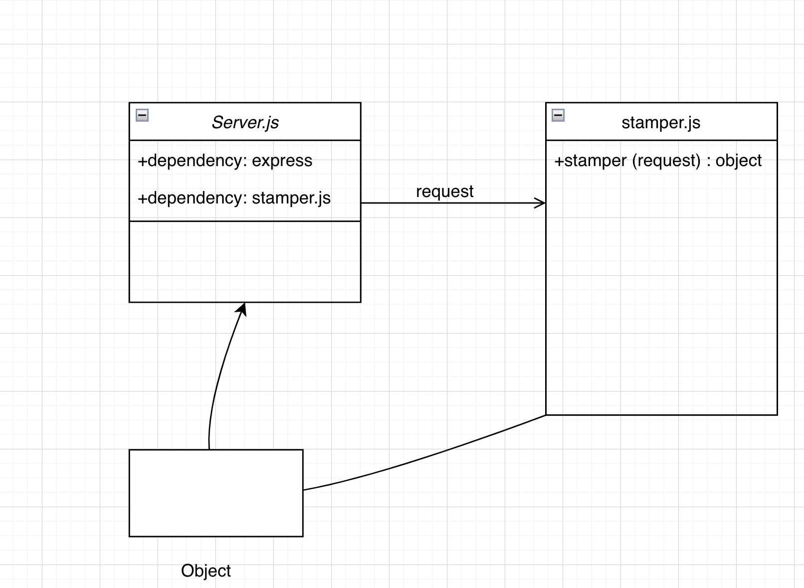

## LAB - 01
###  Server deployment practice
#### Author: A. Agabekian
https://server-deployment-practice-2-d7ap.onrender.com

https://github.com/agabekian/server-deployment-practice/pull/3

#### Setup
.env requirements 

* PORT - Port Number

#### Running the app
* npm start
* Endpoint: /data
  * Returns Object

Tests
* Unit Tests: npm run test

### UML

